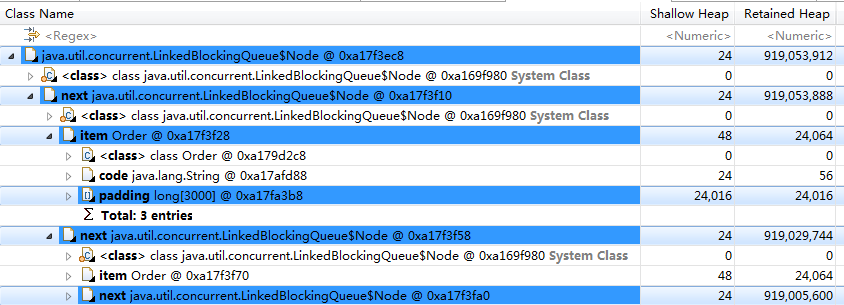
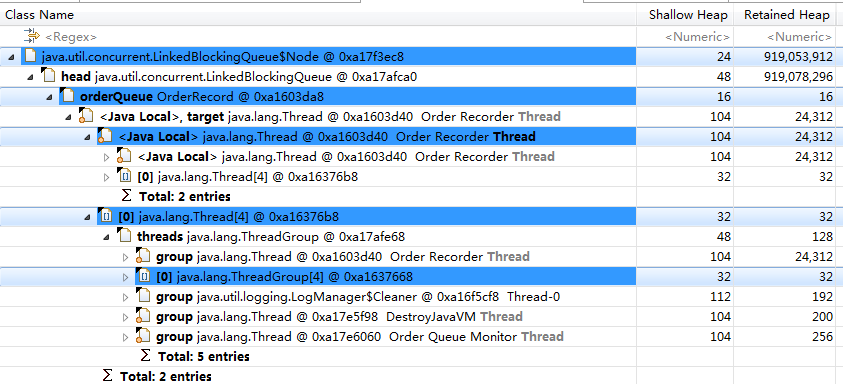

#### Compile&Run ####

首先系统中安装maven工具，通过maven安装依赖包，进入目录下执行

```cmd

$ mvn install

```

运行程序，可能需要修改相应的依赖目录。

```cmd

$ run.bat

```

#### jconsole&jvisualvm ####

使用jdk内置的jconcole监控内存状态，通过远程连接127.0.0.1:9010，堆内存、非堆内存、内存池（堆：PS Eden Space、PS Surviver Space、PS Old Gen；非堆：Code Cache、PS Perm Gen）。

同样jdk内置的jvisualvm也能监控内存状态，新建jmx远程连接127.0.0.1:9010，可以监控到CPU、堆内存、PermGen内存、类、线程状态。可以heap dump，何时进行了？

最好在jconsole观察到PS Eden Space、PS Surviver、PS Old Gen三个都满的时候进行。因为这样最容易发生内存溢出。

#### mat ####

获取到堆dump后，可以通过eclipse的插件mat（memory analyzer tool）进行分析

One instance of "java.util.concurrent.LinkedBlockingQueue" loaded by "<system class loader>" occupies 919,078,296 (**98.98%**) bytes. The instance is referenced by OrderRecord @ 0xa1603da8 , loaded by "sun.misc.Launcher$AppClassLoader @ 0xa1752b70". 

Keywords
java.util.concurrent.LinkedBlockingQueue
sun.misc.Launcher$AppClassLoader @ 0xa1752b70

list objects with outgoing references



list objects with incoming references

